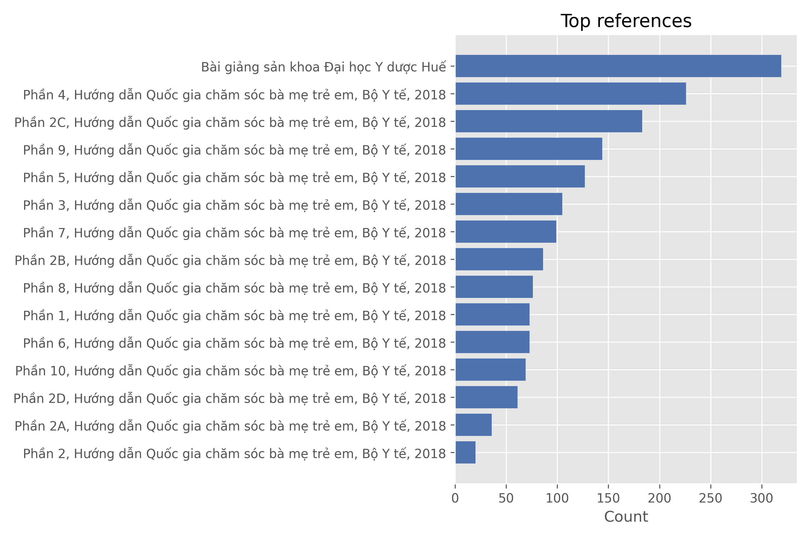
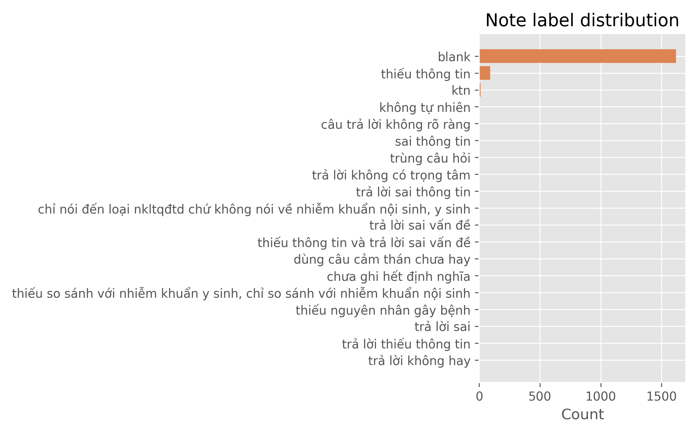
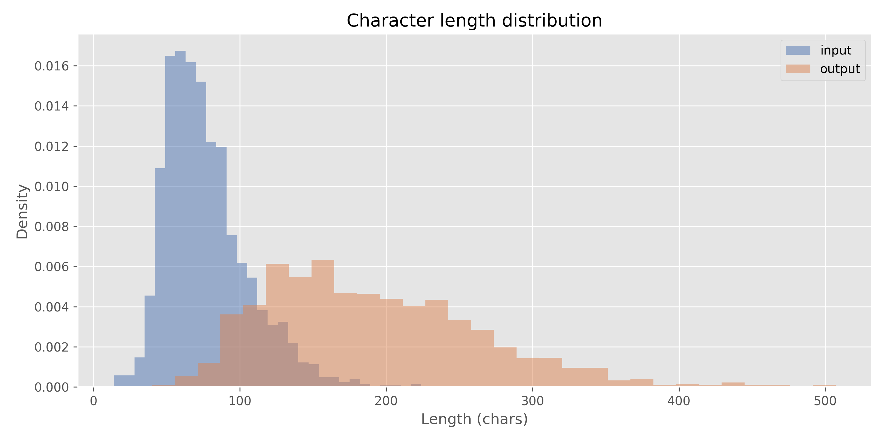

# Dmom_dataset statistics and curation notes

## Overview
- Source: `tungedng2710/Dmom_dataset` (Hugging Face).
- Split coverage: only `train` with **1 757** rows; no validation/test provided.
- Features: `no`, `instruction`, `input`, `output`, `Reference`, `Manually review`, `Note`.
- Language: Vietnamese medical Q&A; `instruction` is constant (`Bạn là bác sĩ hãy trả lời câu hỏi của bệnh nhân`).

## Column-level profile
| Column | Unique values | Blank rows | Notes |
| --- | ---: | ---: | --- |
| no | 1 757 | 0 | Acts as an ID; unique across rows. |
| instruction | 1 | 0 | Single repeated prompt. |
| input | 1 746 | 0 | Patient questions. |
| output | 1 747 | 0 | Model answers. |
| Reference | 42 | 0 | Source guideline/book names. |
| Manually review | 282 | 1 474 (84%) | Free-text flags needing review. |
| Note | 22 | 1 619 (92%) | Short quality labels (e.g., “thiếu thông tin”). |

## Text statistics
Character counts (min/mean/median/90th/95th/99th/max):
- instruction: 47 / 47 / 47 / 47 / 47 / 47 / 47 (fully uniform).
- input: 14 / 76 / 71 / 115 / 132 / 163 / 224.
- output: 40 / 191 / 180 / 290 / 325 / 417 / 507.

Word counts (min/mean/median/90th/95th/99th/max):
- instruction: 12 / 12 / 12 / 12 / 12 / 12 / 12.
- input: 3 / 17.5 / 16 / 26 / 30 / 37 / 49.
- output: 9 / 42.5 / 40 / 64 / 73 / 92 / 114.

## Reference distribution (top 10 of 42)
| Reference | Count |
| --- | ---: |
| Bài giảng sản khoa Đại học Y dược Huế | 319 |
| Phần 4, Hướng dẫn Quốc gia chăm sóc bà mẹ trẻ em, Bộ Y tế, 2018 | 226 |
| Phần 2C, Hướng dẫn Quốc gia chăm sóc bà mẹ trẻ em, Bộ Y tế, 2018 | 183 |
| Phần 9, Hướng dẫn Quốc gia chăm sóc bà mẹ trẻ em, Bộ Y tế, 2018 | 144 |
| Phần 5, Hướng dẫn Quốc gia chăm sóc bà mẹ trẻ em, Bộ Y tế, 2018 | 127 |
| Phần 3, Hướng dẫn Quốc gia chăm sóc bà mẹ trẻ em, Bộ Y tế, 2018 | 105 |
| Phần 7, Hướng dẫn Quốc gia chăm sóc bà mẹ trẻ em, Bộ Y tế, 2018 | 99 |
| Phần 2B, Hướng dẫn Quốc gia chăm sóc bà mẹ trẻ em, Bộ Y tế, 2018 | 86 |
| Phần 8, Hướng dẫn Quốc gia chăm sóc bà mẹ trẻ em, Bộ Y tế, 2018 | 76 |
| Phần 1, Hướng dẫn Quốc gia chăm sóc bà mẹ trẻ em, Bộ Y tế, 2018 | 73 |

## Quality signals and issues
- Manual review: 283 rows (16.1%) filled; 135 rows have both `Manually review` and `Note`.
- Notes: 138 rows (7.9%) carry a quality label; most common (normalized, lowercased) are `thiếu thông tin` (92), `ktn` (12), `không tự nhiên` (5), `câu trả lời không rõ ràng` (5), `sai thông tin` (5).
- Duplicates: 9 exact duplicates across `(instruction, input, output)`; repeated questions/answers for postpartum issues and general counseling.
- Consistency: `instruction` is uniform; `Note` labels vary in casing (`KTN` vs `ktn`) and phrasing (e.g., two identical “Thiếu thông tin” strings counted separately before normalization).
- No PII markers or URLs detected via simple keyword scan (`email`, `@`, `http`, `phone`, `address`).

## Curation recommendations
1) **Deduplicate** exact `(instruction, input, output)` triples (9 rows) and optionally drop the constant `instruction` column during training features.  
2) **Standardize quality labels**: lowercase/strip `Note`, map variants (`KTN`/`ktn`, multiple “thiếu thông tin”) to a controlled vocabulary.  
3) **Filter or tag** rows with `Note` or `Manually review` filled before training; prioritize the 135 rows flagged by both fields for human review.  
4) **Create eval splits**: derive validation/test sets (e.g., 10–15%) stratified by `Reference` to avoid source imbalance.  
5) **Reference auditing**: check top sources (Huế lectures, Bộ Y tế guides) for licensing and recency; ensure minority references (WHO/ACOG/MedlinePlus) are retained to keep topic diversity.  
6) **Length-aware batching**: outputs average 191 chars (42 words) with a tail to 507 chars—consider bucketing by length to stabilize training.  
7) **Topic balance**: many postpartum and contraceptive questions recur; consider sampling across references or deduplicating near-duplicates to reduce bias toward those topics.

## Deep research highlights
- **Provenance/licensing**: The dataset card is empty (no license/homepage/citation). Treat as “license unknown” until confirmed with the author; verify rights before redistribution or model release.
- **Source concentration**: Top 5 references contribute 56.9% of rows; top 10 references 81.8%. Content is heavily drawn from Bộ Y tế maternal/child guidelines and Huế lectures, with few WHO/ACOG/MedlinePlus items—expect national-guideline bias and limited international diversity.
- **Quality flags clustering**: Manual-review rows concentrate in `Phần 4` (80), `Phần 7` (41), `Phần 2C` (38), `Phần 2B` (35), `Phần 6` (31). Note-flagged issues cluster in `Phần 2B` (28), `Phần 2C` (27), `Phần 4` (22), `Phần 1` (18). These sources should be prioritized for human audit.
- **Issue taxonomy**: Normalized `Note` labels show 1619 blank, 92 `thiếu thông tin`, 12 `ktn`, 5 `không tự nhiên`, 5 `câu trả lời không rõ ràng`, 5 `sai thông tin`, plus rarer phrasing variants. Map to a controlled set before scoring/filters.
- **Duplicates/repeats**: 9 exact (instruction, input, output) duplicates; 11 repeated questions (postpartum bleeding/fever/breast pain, infant care, contraception, mental health, male reproductive issues) and 10 repeated answers. Use these as an easy dedup list.
- **Length variation by source** (output chars, top references): `Phần 7` mean 263 (max 438), `Phần 9` mean 254 (max 507), `Phần 8` mean 234 (max 494), `Phần 2C` mean 222 (max 456), `Phần 2B` mean 209 (max 475), while `Phần 5/6/3/4` average 125–143. Training may overweight verbose sources unless length-bucketing or sampling is applied.

## Charts
- Reference skew (top 15):  


- Quality notes coverage (normalized labels):  


- Input/output length densities (characters):  


## Reproducible code
Run in the repo root; outputs the same stats as above.

```python
from datasets import load_dataset
import pandas as pd
import matplotlib.pyplot as plt
from pathlib import Path

ds = load_dataset("tungedng2710/Dmom_dataset", split="train")
df = ds.to_pandas()
n = len(df)

def blanks(col):
    return (col.fillna("").astype(str).str.strip() == "").sum()

print("Rows:", n)
print("Blank counts:", {c: blanks(df[c]) for c in df.columns})

# Length summaries
percentiles = [0.5, 0.9, 0.95, 0.99]
for col in ["instruction", "input", "output"]:
    lens = df[col].fillna("").astype(str).str.len()
    print(f"\\n{col} char lengths:", lens.describe(percentiles=percentiles))
    words = df[col].fillna("").astype(str).str.split().apply(len)
    print(f"{col} word counts:", words.describe(percentiles=percentiles))

# Duplicates
dup = df.duplicated(subset=["instruction", "input", "output"]).sum()
print("\\nExact (instruction, input, output) duplicates:", dup)

# References and labels
print("\\nTop references:\\n", df["Reference"].value_counts().head(10))
norm_note = df["Note"].fillna("").str.strip().str.lower().replace("", "blank")
print("\\nNormalized Note categories:\\n", norm_note.value_counts().head(10))

# Flags
manual = (df["Manually review"].fillna("").str.strip() != "").sum()
note = (df["Note"].fillna("").str.strip() != "").sum()
both = ((df["Manually review"].fillna("").str.strip() != "") & (df["Note"].fillna("").str.strip() != "")).sum()
print(f"Manual review filled: {manual}, Note filled: {note}, Both: {both}")

# Deep-dive slices
df = df.assign(
    norm_note=df["Note"].fillna("").str.strip().str.lower().replace("", "blank"),
    manual_flag=df["Manually review"].fillna("").str.strip() != "",
    note_flag=lambda d: d["norm_note"] != "blank",
    out_len=df["output"].fillna("").astype(str).str.len(),
)
manual_by_ref = df.groupby("Reference")["manual_flag"].sum().sort_values(ascending=False)
note_by_ref = df.groupby("Reference")["note_flag"].sum().sort_values(ascending=False)
print("\\nManual-review by reference (top 10):\\n", manual_by_ref.head(10))
print("\\nNote-flagged by reference (top 10):\\n", note_by_ref.head(10))
print("\\nNormalized Note categories:\\n", df["norm_note"].value_counts().head(15))

# Duplicates/repeats
rep_inputs = df["input"].value_counts()
rep_outputs = df["output"].value_counts()
print("\\nRepeated inputs (count>1):\\n", rep_inputs[rep_inputs > 1])
print("\\nRepeated outputs (count>1):\\n", rep_outputs[rep_outputs > 1])
dup_triples = df.duplicated(subset=["instruction", "input", "output"]).sum()
print("Exact triple duplicates:", dup_triples)

# Length by reference (top sources)
ref_len = df.groupby("Reference")["out_len"].agg(["count", "mean", "median", "max"]).sort_values(by="count", ascending=False)
print("\\nOutput length stats by reference (top 10):\\n", ref_len.head(10).round(1))

# Source concentration
ref_counts = df["Reference"].value_counts()
top5_share = ref_counts.head(5).sum() / n * 100
top10_share = ref_counts.head(10).sum() / n * 100
print(f\"Top 5 references coverage: {top5_share:.2f}% ; Top 10: {top10_share:.2f}%\")

# === Charts ===
out_dir = Path("reports")
out_dir.mkdir(exist_ok=True)

# Reference distribution (top 15)
ref_counts = df["Reference"].value_counts().head(15)
plt.figure(figsize=(9, 6))
plt.barh(ref_counts.index[::-1], ref_counts.values[::-1], color="#4c72b0")
plt.title("Top references")
plt.xlabel("Count")
plt.tight_layout()
plt.savefig(out_dir / "dmom_reference_top15.png", dpi=300)
plt.close()

# Note label distribution (normalized)
norm_note = df["Note"].fillna("").str.strip().str.lower().replace("", "blank")
note_counts = norm_note.value_counts()
plt.figure(figsize=(8, 5))
plt.barh(note_counts.index[::-1], note_counts.values[::-1], color="#dd8452")
plt.title("Note label distribution")
plt.xlabel("Count")
plt.tight_layout()
plt.savefig(out_dir / "dmom_note_labels.png", dpi=300)
plt.close()

# Length distributions for input/output (characters)
plt.figure(figsize=(10, 5))
for col, color in [("input", "#4c72b0"), ("output", "#dd8452")]:
    lens = df[col].fillna("").astype(str).str.len()
    plt.hist(lens, bins=30, alpha=0.5, density=True, label=col, color=color)
plt.title("Character length distribution")
plt.xlabel("Length (chars)")
plt.ylabel("Density")
plt.legend()
plt.tight_layout()
plt.savefig(out_dir / "dmom_length_distribution.png", dpi=300)
plt.close()
```
