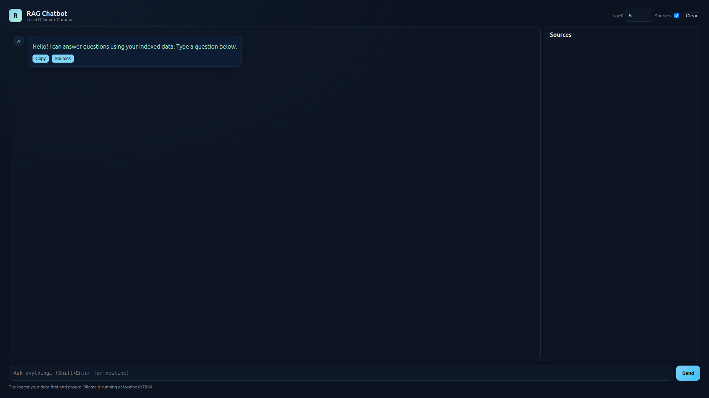

# DMOM Chatbot

Official Code for the Paper [VPHQA_ VIETNAMESE PREGNANCY HEALTH QUESTION ANSWERING DATASET](https://idl-bnc-idrc.dspacedirect.org/server/api/core/bitstreams/0c6bede1-44cc-423f-b35e-4efde1f1faa4/content)

This project builds a Retrieval Augmented Generation (RAG) pipeline over the `tungedng2710/Dmom_dataset` dataset using a local vector database (Chroma) and an Ollama-served LLM.

Demo


Key choices:
- Vector DB: Chroma (local persistent store)
- Embeddings: via Ollama `/api/embeddings` (default: `nomic-embed-text`)
- Generator: selectable — Ollama `/api/chat` or Google Gemini REST
- Dataset: `tungedng2710/Dmom_dataset` (fetched with `datasets`)

Prerequisites
- Python 3.9+
- `pip`
- Ollama running locally and reachable at `http://localhost:7860`
  - Set Ollama to listen on 7860, or proxy 7860 → Ollama. Example: `export OLLAMA_HOST=0.0.0.0:7860 && ollama serve`
  - Pull models:
    - `ollama pull gpt-oss:20b`
    - `ollama pull nomic-embed-text`

Install
```
python -m venv .venv
source .venv/bin/activate
pip install -r requirements.txt
```

Configure (optional)
- Copy `.env.example` to `.env` and adjust values.
- Defaults:
  - `OLLAMA_BASE_URL=http://localhost:7860`
  - `GENERATION_MODEL=gpt-oss:20b`
  - `EMBEDDING_MODEL=nomic-embed-text`
  - `CHROMA_DIR=./data/chroma`
  - `CHAT_BACKEND=ollama` (set to `gemini` to use Gemini)
  - For Gemini: set `GEMINI_API_KEY` and optionally `GEMINI_MODEL` (e.g., `gemini-1.5-flash`)

Commands

1) Ingest from local CSV (recommended for dmom_data.csv)
```
python -m tonrag.cli ingest \
  --csv data/dmom_data.csv \
  --text-field Reference \
  --id-field no \
  --chunk-size 800 \
  --chunk-overlap 120
```

2) Ingest from Hugging Face dataset
```
python -m tonrag.cli ingest \
  --dataset tungedng2710/Dmom_dataset \
  --split train \
  --text-field context \
  --id-field id \
  --chunk-size 800 \
  --chunk-overlap 120
```

Notes:
- If you are unsure of field names, run:
  - CSV: `python -m tonrag.cli inspect --csv data/dmom_data.csv`
  - HF: `python -m tonrag.cli inspect --dataset tungedng2710/Dmom_dataset --split train`
- The script tries a few sensible defaults and will suggest possible column names.

3) Answer a single question
```
python -m tonrag.cli query \
  --question "<your question>" \
  --top-k 5
```

Use Gemini instead of Ollama for this run:
```
python -m tonrag.cli query --question "<your question>" --llm gemini
```

4) Evaluate on the dataset (quick lexical match)
```
# CSV example
python -m tonrag.cli eval \
  --csv data/dmom_data.csv \
  --question-field instruction \
  --answer-field output \
  --top-k 5 \
  --limit 50

# HF example
python -m tonrag.cli eval \
  --dataset tungedng2710/Dmom_dataset \
  --split validation \
  --question-field question \
  --answer-field answer \
  --top-k 5 \
  --limit 50
```

Project Structure
- `tonrag/config.py` – environment/config defaults
- `tonrag/embeddings.py` – Ollama embeddings client; ST fallback if available
- `tonrag/llm.py` – Ollama chat client (non-streaming)
- `tonrag/vectorstore.py` – Chroma wrapper
- `tonrag/dataset.py` – dataset utilities and column auto-detection
- `tonrag/chunking.py` – simple text chunker
- `tonrag/rag.py` – retrieval + prompt assembly + generation
- `tonrag/cli.py` – CLI entry points (ingest/query/eval/inspect)
- `app/server.py` – minimal web app (stdlib) serving `app/static/` and `/api/chat`
- `app/static/` – frontend assets (index.html, style.css, app.js)

Troubleshooting
- If embeddings fail, ensure the embedding model is pulled and available in Ollama: `ollama pull nomic-embed-text`.
- If generation fails, ensure `gpt-oss:20b` is available: `ollama pull gpt-oss:20b`.
- If dataset download fails, ensure your environment has internet access and the `datasets` package can reach Hugging Face.

Web App
- FastAPI server (recommended): `uvicorn app.main:app --host 0.0.0.0 --port 7865`
- Open: `http://localhost:7865`
- Endpoints:
  - `GET /` – serves UI
  - `POST /api/chat` – body: `{ "message": "...", "top_k": 5, "llm": "ollama|gemini" }`
  - `GET /health`
- The app uses the same RAG pipeline and Chroma store.

Legacy stdlib server (optional): `python app/server.py --port 7865`

Chat UI
- Clean bubble layout with avatars, typing indicator, and copy buttons.
- Collapsible “Contexts” under each assistant message to inspect retrieved sources.
- Shift+Enter for newline, Enter to send, clear chat, adjustable Top‑K.
- Answers render Markdown (headings, lists, links, code blocks) safely in the UI.
- CLI: add `--strip-markdown` to print plain‑text answers.
 - LLM selector in the header to switch between Ollama and Gemini per request.

License
- For this template, no explicit license is added; adapt as needed.
